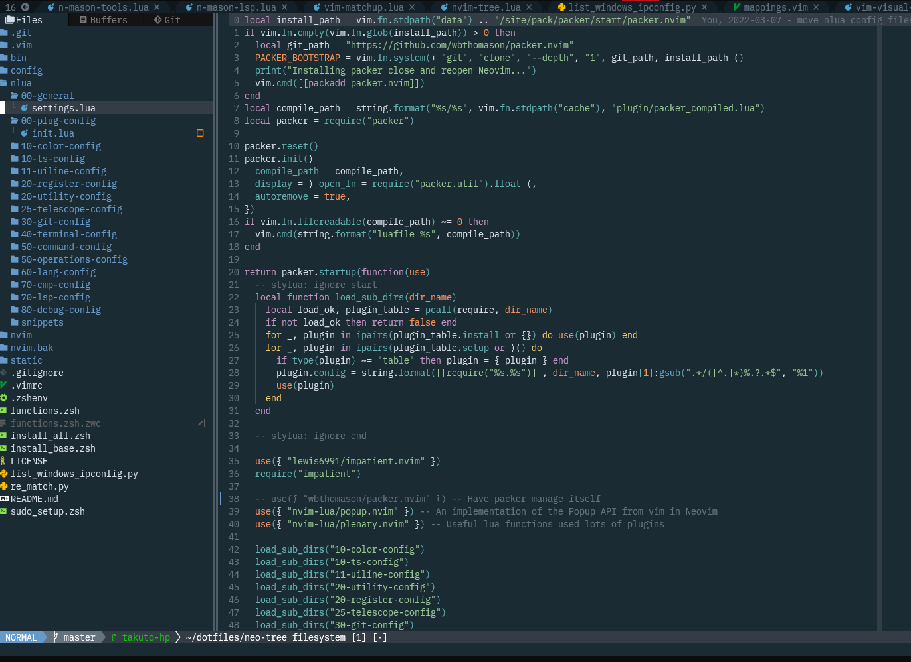

# List of My Favorite Colorscheme

- christianchiarulli/nvcode-color-schemes.vim : `nvcode`
  
- ellisonleao/gruvbox.nvim : `gruvbox`
  
- Mofiqul/vscode.nvim : `vscode`
  
- mhartington/oceanic-next : `OceanicNext`
  

