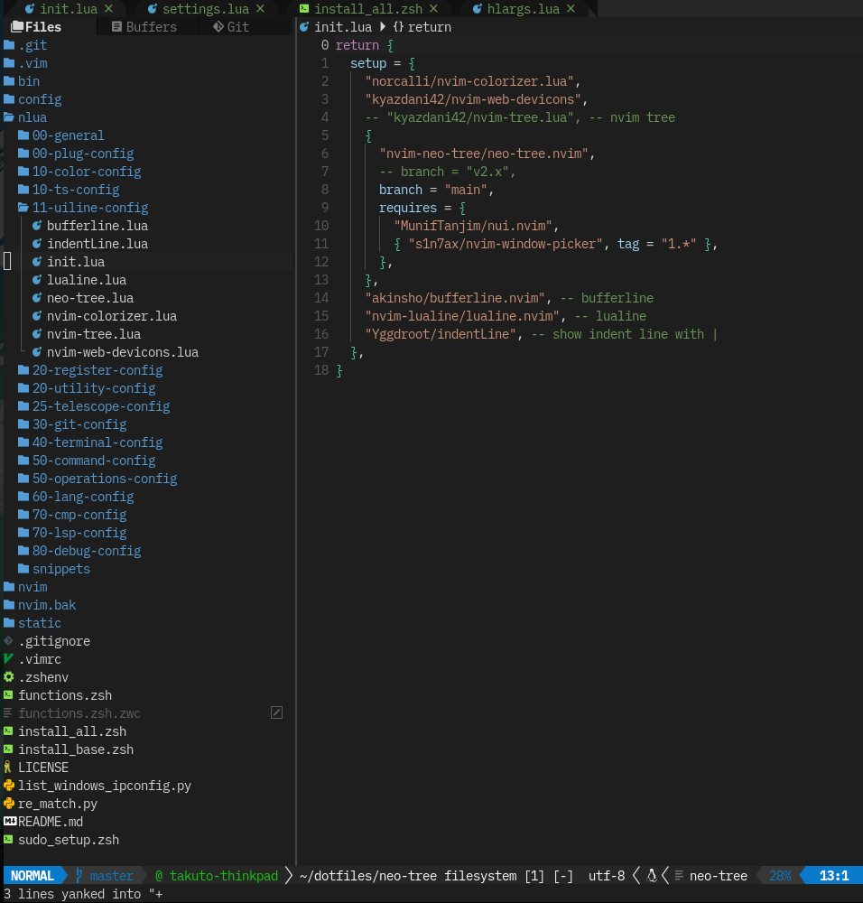

# UI Line Plugins

## What is UI Line

Nvim には画面の上部と下部に現在開いているファイル名や、Input mode (normal, insert ...) を表示する場所がある。
デフォルトでは質素な見た目だが、ここを飾り、使いやすさをバク上げする工夫されたプラグインがたくさん存在する。
また、ファイルを管理したり、その他見た目をアップグレードするプラグインを紹介する。

