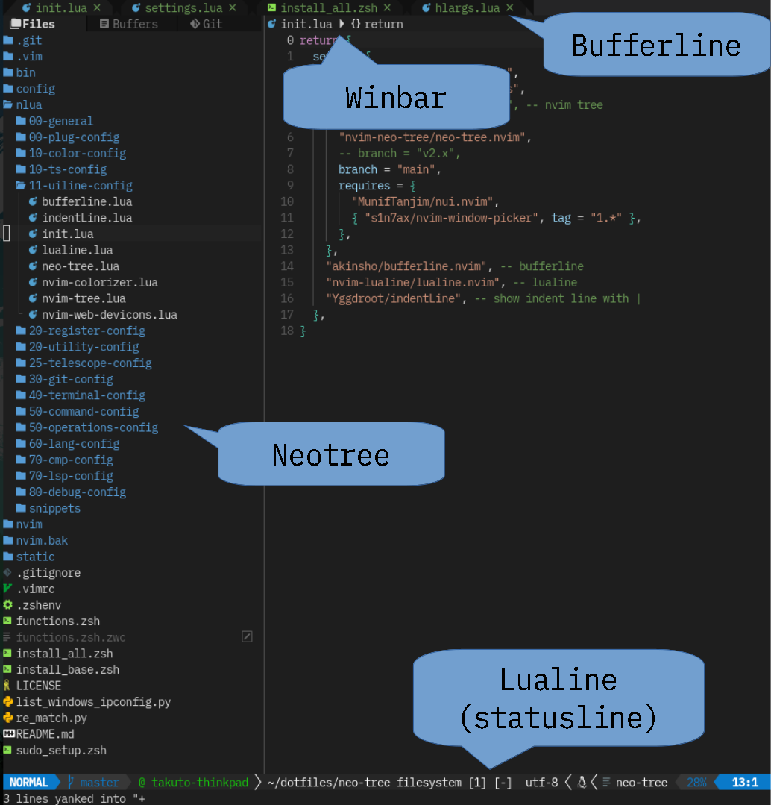

# UI Line Plugins

## What is UI Line

Nvim には画面の上部と下部に現在開いているファイル名や、Input mode (normal, insert ...) を表示する場所がある。
デフォルトでは質素な見た目だが、ここを飾り、使いやすさをバク上げする工夫されたプラグインがたくさん存在する。
また、ファイルを管理したり、その他見た目をアップグレードするプラグインを紹介する。



上の画像のように Nvim の上下左右に機能を追加することができ、それぞれ専用のプラグインが存在する。

## Recommended Plugins

かっこよく飾るプラグインが数多存在しますが、ここでは私が使用しているものを紹介します。

- Bufferline : [bufferline.nvim](11-uiline-config/bufferline)
- Statusline : [lualine.nvim](11-uiline-config/lualine)
- Winbar : lspsaga.nvim (details in [70-lsp-config](70-lsp-config))
- File Browser : [neo-tree.lua](11-uiline-config/neo-tree)

## Fancy Plugins to Enrich the Editor Buffer

編集画面を少し使いやすくするために、色をつけてくれたりするプラグインたちです。
セットアップは非常にかんたんなのでここで紹介します。

### [nvim-colorizer.lua](https://github.com/norcalli/nvim-colorizer.lua)

- 文章中の色コードだと判断できる部分をその色で塗ってくれる


```lua filename="11-uiline-config/nvim-colorizer.lua"
require("colorizer").setup()
```

### [nvim-web-devicons](https://github.com/kyazdani42/nvim-web-devicons)

- `filetype`に基づいたアイコンの辞書を提供するプラグイン。
- Filetree がとても見やすくなる（画像のファイル名の前にあるアイコンを定義している）


```lua filename="11-uiline-config/nvim-web-devicons.lua"
require("nvim-web-devicons").setup({
  -- your personal icons can go here (to override)
  -- you can specify color or cterm_color instead of specifying both of them
  -- DevIcon will be appended to `name`
  override = {
    snippets = {
      icon = "",
      color = "#DBC63E",
      name = "Snippets",
    },
    ["poetry.lock"] = {
      icon = "",
      color = "#41535b",
      name = "PoetryLockFile",
    },
  },
  -- globally enable default icons (default to false)
  -- will get overriden by `get_icons` option
  default = true,
})
```

### [indentLine](https://github.com/Yggdroot/indentLine)

- インデントに合わせて縦線を引いてくれる


```lua filename="11-uiline-config/indentLine.lua"
vim.g.indentLine_char = "▏" -- Change to any character
vim.g.indentLine_bufTypeExclude = { "help", "terminal", "neo-tree" }
```

## Other Cool ~but not recommended~ Plugins

Might be unstable or very old.

- File Browser
  - [nvim-tree.lua](https://github.com/kyazdani42/nvim-tree.lua)
  - [nerdtree](https://github.com/preservim/nerdtree)
  - [Netrw](https://pc.oreda.net/software/filer/netrw) : Comes by default in `vim` / `nvim`
- Bufferline & Statusline
  - [powerline](https://github.com/powerline/powerline)
  - [airline](https://www.vim.org/scripts/script.php?script_id=4661)
  - [lightline.vim](https://github.com/itchyny/lightline.vim)
  - [vim-buftabline](https://github.com/ap/vim-buftabline)
