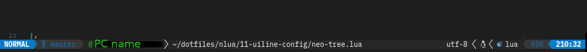

# lualine.nvim

[lualine.nvim](https://github.com/nvim-lualine/lualine.nvim) は statusline を彩るためのプラグインです。
デフォルトの Vim では statusline には今開いているファイル名のみが表示されますが、もっと多くの情報をもっと見やすい形で表示しましょう。

なお、このプラグインは少し重い(スタートアップ時に、ロードは裏でやってるので編集の邪魔はしないが表示されるまで少し時間がかかる。)ので、他のプラグインを使用するのもありかもしれません。

## Examples

Taken from [lualine.nvim](https://github.com/nvim-lualine/lualine.nvim#screenshots)


## Setup

このプラグインも無限にカスタマイズできるので、公式の説明を読んで自分好みにセットアップすることをおすすめします。



```lua filename="11-uiline-config/lualine.lua"
require("lualine").setup({
  options = {
    icons_enabled = true,
    theme = "auto",
    component_separators = { left = "", right = "" },
    section_separators = { left = "", right = "" },
    disabled_filetypes = { "toggleterm" },
    always_divide_middle = false,
  },
  sections = {
    lualine_a = { "mode" },
    lualine_b = { "branch", "diff", "diagnostics" },
    lualine_c = { { "hostname", icon = "@", color = { fg = "#16c60c" } }, { "filename", path = 3 } },
    lualine_x = { "encoding", "fileformat", "filetype" },
    lualine_y = { "progress" },
    lualine_z = { "location" },
  },
  inactive_sections = {
    lualine_a = {},
    lualine_b = {},
    lualine_c = {},
    lualine_x = { "location" },
    lualine_y = {},
    lualine_z = {},
  },
  tabline = {},
  extensions = {},
})
```
