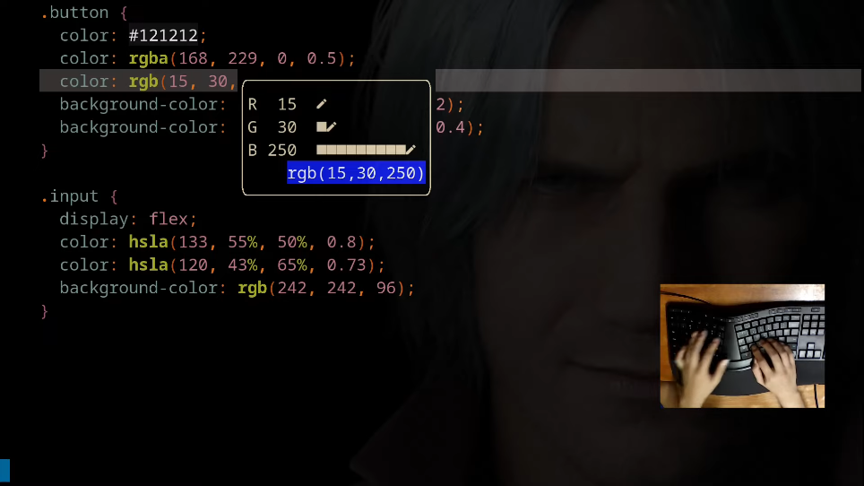

# color-picker.nvim

[color-picker.nvim](https://github.com/ziontee113/color-picker.nvim)



色を示してそうな文字列の上でこのプラグインを発火すると、ダイアログがでてきて色を調節することができる。

RGB や HSLA などいろいろなフォーマットに対応していて、相互変換することも可能。

確かこの開発者が 15 歳かそれぐらいで、私は応援の意味でこれを使ってる。
おそらく対抗馬の [colorutils.nvim](https://github.com/nvim-colortils/colortils.nvim) のほうが機能が豊富でバグも少ないらしいからそっちをおすすめする。

## Setup

```lua filename="20-utility-config/colortils.nvim"
local function getopts(desc)
  return { noremap = true, silent = true, desc = desc }
end
local map = "\\\\c"
vim.keymap.set("n", map, "<cmd>PickColor<cr>", getopts("<cmd>PickColor<cr>"))
vim.keymap.set("i", map, "<cmd>PickColorInsert<cr>", getopts("<cmd>PickColorInsert<cr>"))

require("color-picker").setup({
  ["keymap"] = {
    ["U"] = "<Plug>Slider5Decrease",
    ["O"] = "<Plug>Slider5Increase",
  },
})

vim.cmd([[hi FloatBorder guibg=NONE]])
```

Normal / Insert mode で色っぽい単語の上で `\\c` と押すと立ち上がるキーバインドを登録している。
