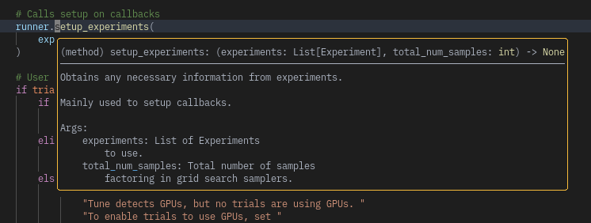
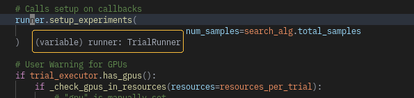
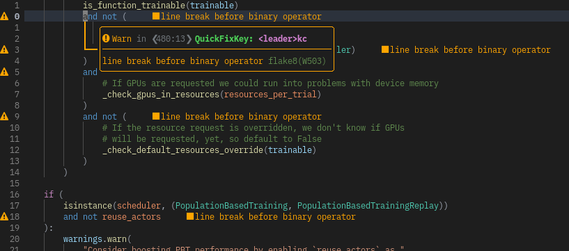

# Setup LSP with mason.nvim

ここでは複数のファイルを作成してセットアップをしていきます。

今までのセットアップの方法と少し違うので気をつけてください。

## Mason.nvim : [GitHub](https://github.com/williamboman/mason.nvim)

Mason.nvim を使うと LSP のセットアップに何も頭を使う必要はありません。多分

まずは大本のセットアップをしていきましょう。
このファイルから他の設定ファイル (`"70-lsp-config.n-lsp-base"` など) を呼び出していきます。

```lua filename="70-lsp-config/mason.lua"
require("mason").setup({
  ui = {
    keymaps = {
      -- Keymap to expand a package
      toggle_package_expand = "<CR>",
      -- Keymap to install the package under the current cursor position
      install_package = "i",
      -- Keymap to reinstall/update the package under the current cursor position
      update_package = "u",
      -- Keymap to check for new version for the package under the current cursor position
      check_package_version = "c",
      -- Keymap to update all installed packages
      update_all_packages = "U",
      -- Keymap to check which installed packages are outdated
      check_outdated_packages = "C",
      -- Keymap to uninstall a package
      uninstall_package = "X",
      -- Keymap to cancel a package installation
      cancel_installation = "<C-c>",
      -- Keymap to apply language filter
      apply_language_filter = "<C-f>",
    },
  },
  max_concurrent_installers = 8,
})
require("70-lsp-config.n-lsp-base").setup({})
require("70-lsp-config.n-mason-lsp").setup({})
require("70-lsp-config.n-mason-tools").setup({})
require("70-lsp-config.n-lsp-null").setup({})
require("70-lsp-config.n-lsp-saga").setup({})
require("textobj-diagnostic").setup({})
```

## n-lsp-base

まずはじめに LSP に必要な基礎的な設定をしていきます。
ファイル名は `70-lsp-config/n-lsp-base.lua` に書いていきます。

まずは見た目の設定をしていきます。

見た目とは、`lsp.hover` などをしたときに表示されるウィンドウの見た目のことです。
例えば VSCode だと関数の上にマウスカーソルを持っていくとその関数への引数の型や戻り値の型が表示されると思います。

この設定ではこんな感じの見た目になります。


また、変数の上で hover することでその変数の型などもわかります。


さらに、エラーやワーニングもいい感じに表示してくれます。


```lua filename="70-lsp-config/n-lsp-base.lua"
local M = {}

M.setup = function(_)
  local signs = {
    { name = "DiagnosticSignError", text = "" },
    { name = "DiagnosticSignWarn", text = "" },
    { name = "DiagnosticSignHint", text = "" },
    { name = "DiagnosticSignInfo", text = "" },
  }
  for _, sign in ipairs(signs) do
    vim.fn.sign_define(sign.name, { texthl = sign.name, text = sign.text, numhl = "" })
  end
  vim.diagnostic.config({
    virtual_text = true,
    signs = {
      active = signs,
    },
    update_in_insert = true,
    underline = false,
    severity_sort = true,
    float = {
      focusable = false,
      style = "minimal",
      border = "rounded",
      source = "always",
      header = "",
      prefix = "",
    },
  })
  vim.lsp.handlers["textDocument/hover"] = vim.lsp.with(vim.lsp.handlers.hover, {
    border = "rounded",
  })
  vim.lsp.handlers["textDocument/signatureHelp"] = vim.lsp.with(vim.lsp.handlers.signature_help, {
    border = "rounded",
  })
end
```

### Mappings and Capabilities

主にキーバインドを設定します。
とてもよく使う、使い勝手の良いキーバインドたちなのでぜひ覚えてください。

| Keybind | Memo              | Action                                                                                             |
| ------- | ----------------- | -------------------------------------------------------------------------------------------------- |
| `gD`    | Go to declaration | 関数定義などにカーソルをおいた状態でこれを押すと、その関数が呼ばれている場所のリストが表示される。 |
| `gd`    | Go to definition  | 関数や変数の上で実行すると、それが定義された場所に飛ぶ。                                           |

また、[LSP saga](#n-lsp-saga) をインストールする場合はコメントアウトされたキーバインドたちはそっちで定義するのでこのままで良いです。
もし LSP saga を入れたくない場合はこれらのキーバインドを有効にしてください。

Capabilities は理解しなくて大丈夫です。サーバ側にこのエディタはどんなことが許可されているかみたいなのを通信確立時に送るものです。

```lua filename="70-lsp-config/n-lsp-base.lua"
M.lsp_keymaps = function(bufnr)
  local function getopts(desc)
    return { noremap = true, silent = true, buffer = bufnr, desc = desc }
  end

  vim.keymap.set("n", "gD", vim.lsp.buf.declaration, getopts("vim.lsp.buf.declaration"))
  vim.keymap.set("n", "gd", vim.lsp.buf.definition, getopts("vim.lsp.buf.definition"))
  vim.keymap.set("n", "gI", vim.lsp.buf.implementation, getopts("vim.lsp.buf.implementation"))
  vim.keymap.set("n", "<leader>kl", vim.diagnostic.setloclist, getopts("vim.diagnostic.setloclist"))
  vim.keymap.set("n", "<leader>kD", vim.diagnostic.open_float, getopts("vim.diagnostic.open_float"))
  vim.cmd([[ command! Format execute 'lua vim.lsp.buf.formatting()' ]])
  -- vim.keymap.set("n", "K", vim.lsp.buf.hover, getopts("vim.lsp.buf.hover"))
  -- vim.keymap.set("n", "<leader>nh", vim.lsp.buf.signature_help, getopts("vim.lsp.buf.signature_help"))
  -- vim.keymap.set("n", "<leader>cn", vim.lsp.buf.rename, getopts("vim.lsp.buf.rename"))
  -- vim.keymap.set("n", "<leader>gr", vim.lsp.buf.references, getopts("vim.lsp.buf.references"))
  -- vim.keymap.set("n", "<leader>ca", vim.lsp.buf.code_action, getopts("vim.lsp.buf.code_action"))
  -- vim.keymap.set("n", "[d", vim.diagnostic.goto_prev, getopts("vim.diagnostic.goto_prev"))
  -- vim.keymap.set("n", "]d", vim.diagnostic.goto_next, getopts("vim.diagnostic.goto_next"))
end

local capabilities = vim.lsp.protocol.make_client_capabilities()
capabilities.textDocument.foldingRange = {
  dynamicRegistration = false,
  lineFoldingOnly = true,
}
capabilities.offsetEncoding = { "utf-16" }
M.capabilities = require("cmp_nvim_lsp").default_capabilities(capabilities)

return M
```

## n-mason-lsp

次に、必要なサーバたちをインストールしていきます。

これには 2 通りの方法があります。
最初の方法は、`:Mason` というコマンドを実行するとウィンドウが立ち上がり、必要なサーバで `i` を押すとそれをインストールしてくれます。

しかし、いちいち探すの大変だしセットアップをするたびに入れ直さないと行けないので、それを一気にやる方法が下の方法です。

この設定では使用可能なすべてのサーバが列挙されているので、必要なサーバのところだけコメントインすることで、インストールされてなかったら勝手にインストールしてくれるようになります。
なお、value の `{}` はその LSP をセットアップするときに渡す引数を設定できます。
基本的にはデフォルト値を使えば十分だと思います。
どのような設定が渡せるかはサーバによってまちまちで調べるのも難しいのであんまりこだわらないことをおすすめします。
が、もしやり方が知りたければ私に連絡してください。

```lua filename="70-lsp-config/n-mason-lsp.lua"
local lspconfig = require("lspconfig")
local lsp_base = require("70-lsp-config.n-lsp-base")

local servers = {
  -- awk_ls = {}, -- AWK
  -- angularls = {}, -- Angular
  -- ansiblels = {}, -- Ansible
  -- arduino_language_server = {}, -- Arduino
  -- asm_lsp = {}, -- Assembly (GAS/NASM, GO)
  -- spectral = {}, -- AsyncAPI
  bashls = {}, -- Bash
  -- beancount = {}, -- Beancount
  -- bicep = {}, -- Bicep
  -- ccls = {}, -- C
  clangd = {}, -- C, C++
  -- csharp_ls = {}, -- C#
  -- omnisharp = {}, -- C#
  -- ccls = {}, -- C++
  cmake = {}, -- CMake
  -- cssls = {}, -- CSS
  -- cssmodules_ls = {}, -- CSS
  -- clojure_lsp = {}, -- Clojure
  -- codeqlls = {}, -- CodeQL
  -- crystalline = {}, -- Crystal
  -- scry = {}, -- Crystal
  -- cucumber_language_server = {}, -- Cucumber
  -- dartls = {}, -- Dart
  -- denols = {}, -- Deno
  -- diagnosticls = {}, -- Diagnostic (general purpose server)
  -- serve_d = {}, -- Dlang
  -- dockerls = {}, -- Docker
  -- dotls = {}, -- Dot
  -- efm = {}, -- EFM (general purpose server)
  -- eslint = {}, -- ESLint
  -- elixirls = {}, -- Elixir
  -- elmls = {}, -- Elm
  -- ember = {}, -- Ember
  emmet_ls = {}, -- Emmet
  -- erg_language_server = {}, -- Erg
  -- erlangls = {}, -- Erlang
  -- fsautocomplete = {}, -- F#
  -- flux_lsp = {}, -- Flux
  -- foam_ls = {}, -- Foam (OpenFOAM)
  -- fortls = {}, -- Fortran
  -- golangci_lint_ls = {}, -- Go
  -- gopls = {}, -- Go
  -- grammarly = {}, -- Grammarly
  -- graphql = {}, -- GraphQL
  -- groovyls = {}, -- Groovy
  -- html = {}, -- HTML
  -- hls = {}, -- Haskell
  jsonls = {}, -- JSON
  jdtls = {}, -- Java
  -- quick_lint_js = {}, -- JavaScript
  tsserver = {}, -- JavaScript, TypeScript
  -- jsonnet_ls = {}, -- Jsonnet
  -- julials = {}, -- Julia
  -- kotlin_language_server = {}, -- Kotlin
  -- ltex = {}, -- LaTeX
  texlab = {}, -- LaTeX
  -- lelwel_ls = {}, -- Lelwel
  sumneko_lua = {}, -- Lua
  -- remark_ls = {}, -- Markdown
  -- zeta_note = {}, -- Markdown
  -- zk = {}, -- Markdown
  -- nickel_ls = {}, -- Nickel
  -- nimls = {}, -- Nim
  -- ocamlls = {}, -- OCaml
  -- ccls = {}, -- Objective C
  -- bsl_ls = {}, -- OneScript, 1C:Enterprise
  -- spectral = {}, -- OpenAPI
  -- opencl_ls = {}, -- OpenCL
  -- intelephense = {}, -- PHP
  -- phpactor = {}, -- PHP
  -- psalm = {}, -- PHP
  -- powershell_es = {}, -- Powershell
  -- prismals = {}, -- Prisma
  -- puppet = {}, -- Puppet
  -- purescriptls = {}, -- PureScript
  -- jedi_language_server = {}, -- Python
  pyright = {}, -- Python
  -- pylsp = {
  --   settings = {
  --     pylsp = {
  --       plugins = {
  --         pycodestyle = { maxLineLength = 120 },
  --         pyflakes = { enabled = false },
  --       },
  --     },
  --   },
  -- }, -- Python
  -- rescriptls = {}, -- ReScript
  -- rome = {}, -- Rome
  -- solargraph = {}, -- Ruby
  rust_analyzer = {}, -- Rust
  -- sqlls = {}, -- SQL
  -- sqls = {}, -- SQL
  -- salt_ls = {}, -- Salt
  -- theme_check = {}, -- Shopify Theme Check
  -- solang = {}, -- Solidity
  -- solc = {}, -- Solidity
  -- solidity_ls = {}, -- Solidity (VSCode)
  -- sorbet = {}, -- Sorbet
  -- esbonio = {}, -- Sphinx
  -- stylelint_lsp = {}, -- Stylelint
  -- svelte = {}, -- Svelte
  -- sourcekit = {}, -- Swift
  -- verible = {}, -- SystemVerilog
  taplo = {}, -- TOML
  -- tailwindcss = {}, -- Tailwind CSS
  -- terraformls = {}, -- Terraform
  -- tflint = {}, -- Terraform
  -- vala_ls = {}, -- Vala
  vimls = {}, -- VimL
  -- volar = {}, -- Vue
  vuels = {
    -- https://stackoverflow.com/questions/65913547/ionic-slot-attributes-are-deprecated-eslint-plugin-vue
    init_options = { config = { vetur = { validation = { template = false } } } },
  }, -- Vue
  -- lemminx = {}, -- XML
  -- yamlls = {}, -- YAML
  -- zls = {}, -- Zig
}

local lsp_list = {}
for k, _ in pairs(servers) do
  lsp_list[#lsp_list + 1] = k
end
local stop_lsp_fmt = {
  tsserver = 1,
  vuels = 1,
  eslint = 1,
  pylsp = 1,
}

require("mason-lspconfig").setup({
  ensure_installed = lsp_list,
  automatic_installation = true,
})

local global_opts = {
  capabilities = lsp_base.capabilities,
  on_attach = function(client, bufnr)
    if stop_lsp_fmt[client.name] ~= nil then
      client.server_capabilities.documentFormattingProvider = false
    end
    lsp_base.lsp_keymaps(bufnr)
    require("aerial").on_attach(client, bufnr)
  end,
}

local M = {}

M.setup = function(_)
  for server_name, server_opt in pairs(servers) do
    local is_opt, file_opt = pcall(require, "70-lsp-config.settings." .. server_name)
    local opts = vim.tbl_deep_extend("force", global_opts, is_opt and file_opt or {}, server_opt or {})
    lspconfig[server_name].setup(opts)
  end
end

return M
```

## n-mason-tools

`:Mason` を開くと、LSP だけではないことに気づくと思います。

Mason は実は LSP 以外にもデバッガーや Linter、Formatter もインストールすることができます。

ということで、必要なものを入れるには、上でいったのと全く同じように、`:Mason` で開いて `i` を押すか、下の設定ファイルを使用します。

これはインストールするだけで、nvim で実際に Linter やフォーマッタが動作するには [## n-lsp-null](#n-lsp-null) を行なってください。

追加したい場合は、一度 nvim を再起動すれば自動でインストールされるようになります。

```lua filename="70-lsp-config/n-mason-tools.lua"
local tools = {
  -- DAP
  "debugpy",
  -- "node-debug2-adapter",

  -- Linter
  "cmakelang",
  "cpplint",
  "eslint_d",
  "flake8",
  "luacheck",
  "markdownlint",
  "pylint",
  "yamllint",

  -- Formatter
  "autopep8",
  "cmakelang",
  "isort",
  "luaformatter",
  "prettier",
  "shfmt",
  "stylua",
}

local M = {}

M.setup = function(_)
  require("mason-tool-installer").setup({
    ensure_installed = tools,
    auto_update = true,
    run_on_start = true,
  })
end

return M
```

## n-lsp-null

Linter やフォーマッタは基本的に LSP にはそっておらず、すべてのツールが己の道を突き進んでいます。
そのため、エディタにうまい感じで導入するのはとてもむずかしく、また骨の折れる作業でした。

しかし [null-ls.nvim](https://github.com/jose-elias-alvarez/null-ls.nvim) というプラグインが各 Linter などの独自実装プロトコルを LSP 語に翻訳して LSP として扱うことができるようにしてくれます。

下のセットアップでは、`prettier`, `eslint-diag`, `eslint-fmt`, `autopep8`, `stylua`, `rustfmt` をセットアップしています。

ちなみに

- Linter
  - コードが正しく書かれているかをチェックする機能
  - 例えば `;` のありなしとかインデント幅とか一行の長さとか (一般的に 120 文字以内に収めなさいと言われている)
- Formatter
  - 上の Linter で怒られる部分を可能な限り自動で修正してくれる。
  - あと長過ぎる行を自動でいい感じに改行を入れてくれたりする
- Diagnostics
  - 言語の仕様上間違っている部分を指摘してくれる
  - 引数が足りないや、引数の型が間違っているや、かっこが足りないなど
  - この機能は LSP 自体に内包されていることも多い

基本的には自分の開発環境に合わせて sources の中を変更して、それ以外の部分はおまじないだと思ってください。

その他の source の一覧は [null-ls - Build-in Sources](https://github.com/jose-elias-alvarez/null-ls.nvim/blob/main/doc/BUILTINS.md) で確認できます。

```lua filename="70-lsp-config/n-lsp-null.lua"
local null_ls = require("null-ls")

-- https://github.com/jose-elias-alvarez/null-ls.nvim/tree/main/lua/null-ls/builtins/formatting
local fmt = null_ls.builtins.formatting
-- https://github.com/jose-elias-alvarez/null-ls.nvim/tree/main/lua/null-ls/builtins/diagnostics
local diag = null_ls.builtins.diagnostics

local M = {}

M.setup = function(_)
  null_ls.setup({
    on_attach = function(client)
      if client.server_capabilities.documentFormattingProvider then
        vim.cmd([[
          augroup LspFormatting
          autocmd! * <buffer>
          autocmd BufWritePre <buffer> lua vim.lsp.buf.format({ sync = true, timeout_ms = 1000 })
          augroup END
        ]])
      end
    end,
    debug = true,
    sources = {
      -- js, ts
      fmt.prettier,
      diag.eslint,
      fmt.eslint,
      -- python
      fmt.autopep8.with({ extra_args = { "--max-line-length=120", "--aggressive", "--aggressive" } }),
      -- diag.flake8.with({ extra_args = { "--max-line-length=120", "--ignore=F405" } }),
      -- lua
      fmt.stylua.with({ extra_args = { "--search-parent-directories" } }),
      -- rust
      fmt.rustfmt,
    },
  })
end

return M
```

## n-lsp-saga

[LSP saga](https://github.com/glepnir/lspsaga.nvim) とは、LSP あたりの機能をかっこよく表示してくれるプラグインです。

また、このプラグインはとても開発が活発に行われているので、常に新しい機能が追加されています。

- lsp finder (lsp.declaration の進化系)
  - 
- peek definition
  - 
- lsp hover doc
  - 
- Rename with preview and select
  - 
- Jump and show diagnostics
  - 
- Fastest show symbols in winbar by use cache
  - 画面の上部に今いる関数やファイル名を動的に表示する
  - 
- Outline
  - 画面右側にコードのアウトラインを表示。また選択するとその場所にジャンプできる
  - 

### Setup

- セットアップ

```lua filename="70-lsp-config/n-lsp-saga.lua"
local M = {}

local saga = require("lspsaga")
local action = require("lspsaga.codeaction")

local function set_config(_)
  saga.init_lsp_saga({
    border_style = "rounded", -- "single" | "double" | "rounded" | "bold" | "plus"
    diagnostic_header = { " ", " ", " ", "ﴞ " },
    code_action_lightbulb = {
      sign = false,
    },
    finder_action_keys = {
      open = "e",
      vsplit = "s",
      split = "i",
      tabe = "t",
      quit = "q",
      scroll_down = "<C-f>",
      scroll_up = "<C-b>",
    },
    code_action_keys = {
      quit = "q",
      exec = "e",
    },
    symbol_in_winbar = {
      in_custom = false,
      enable = vim.g.personal_options.lsp_saga.winbar,
      separator = "  ",
      show_file = true,
      click_support = function(node, clicks, button, modifiers)
        local st = node.range.start
        local en = node.range["end"]
        if button == "l" then -- left click: jump to start
          vim.fn.cursor(st.line + 1, st.character + 1)
        elseif button == "r" then -- right click: jump to end
          vim.fn.cursor(en.line + 1, en.character + 1)
        elseif button == "m" then -- select whole region
          vim.fn.cursor(st.line + 1, st.character + 1)
          vim.cmd("normal v")
          vim.fn.cursor(en.line + 1, en.character + 1)
        end
      end,
    },
    show_outline = {
      jump_key = "o",
      auto_refresh = true,
      win_width = 40,
    },
  })
end
```

- キーバインドたち

| Keybind      | Memo        | Action                                                                                         |
| ------------ | ----------- | ---------------------------------------------------------------------------------------------- |
| `<leader>kf` | finder      | カーソル上の関数などが登場する部分を羅列してくれる。（定義参照関わらず）                       |
| `<leader>kc` | Code Action | コードアクションを実行する。例えば勝手に import してくれたり、インデントを揃えてくれたりする。 |
| `K`          | keyword     | カーソル上の定義を表示する。めっちゃ便利。                                                     |
| `<leader>ko` | Outline     | 上で紹介したアウトラインを表示する                                                             |
| `<leader>kr` | Rename      | カーソル上の変数や関数の名称を変更する。対応するすべてのものが同時に切り替わってくれる。       |
| `<leader>kd` | Diagnostic  | その行でエラーがある場合に、そのエラーの詳細を表示してくれる。                                 |
| `]d`, `[d`   | Diagnostic  | 次・前のエラーに飛ぶ。PR を投げる直前とかのチェックに使いやすい                                |

```lua filename="70-lsp-config/n-lsp-saga.lua"
local function getopts(is_noremap, desc)
  return { silent = true, noremap = is_noremap, desc = desc }
end

local function set_keybinds()
  local function cmd(c)
    return string.format("<Cmd>Lspsaga %s<CR>", c)
  end

  local lsp_prefix = "<leader>k"

  -- Async lsp finder: lsp finder to find the cursor word definition and reference
  vim.keymap.set("n", lsp_prefix .. "f", cmd("lsp_finder"), getopts(true, "lspsaga.lsp_finder"))

  -- Code Action
  vim.keymap.set("n", lsp_prefix .. "c", cmd("code_action"), getopts(true, "lspsaga.codeaction.code_action"))
  vim.keymap.set("v", lsp_prefix .. "c", function()
    vim.fn.feedkeys(vim.api.nvim_replace_termcodes("<C-U>", true, false, true))
    vim.cmd("<Cmd><C-U>Lspsaga range_code_action<CR>")
  end, getopts(true, "lspsaga.codeaction.range_code_action()"))

  -- show hover doc
  vim.keymap.set("n", "K", cmd("hover_doc"), getopts(false, "lspsaga.hover.render_hover_doc"))
  -- scroll down hover doc or scroll in definition preview
  vim.keymap.set("n", "<C-f>", function()
    action.smart_scroll_with_saga(1)
  end, getopts(false, "lspsaga.codeaction.smart_scroll_with_saga(1)"))
  -- scroll up hover doc
  vim.keymap.set("n", "<C-b>", function()
    action.smart_scroll_with_saga(-1)
  end, getopts(false, "lspsaga.codeaction.smart_scroll_with_saga(-1)"))

  -- Outline
  vim.keymap.set("n", lsp_prefix .. "o", "<Cmd>LSoutlineToggle<CR>", getopts(true, "lspsaga.outline_toggle"))

  -- rename
  vim.keymap.set("n", lsp_prefix .. "r", cmd("rename"), getopts(true, "lspsaga.lsp_rename"))
  -- preview definition
  vim.keymap.set("n", lsp_prefix .. "k", cmd("peek_definition"), getopts(true, "lspsaga.preview_definition"))

  -- diagnostic
  vim.keymap.set("n", lsp_prefix .. "d", cmd("show_line_diagnostics"), getopts(true, "lspsaga.show_line_diagnostics"))
  -- jump diagnostic
  vim.keymap.set("n", "[d", cmd("diagnostic_jump_prev"), getopts(true, "lspsaga.diagnostic.goto_prev"))
  vim.keymap.set("n", "]d", cmd("diagnostic_jump_next"), getopts(true, "lspsaga.diagnostic.goto_next"))
end

M.setup = function(opts)
  set_config(opts)
  set_keybinds()
end

return M
```
