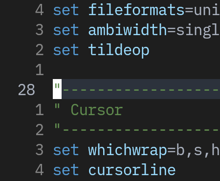
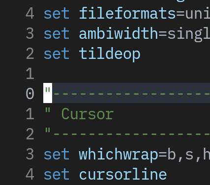
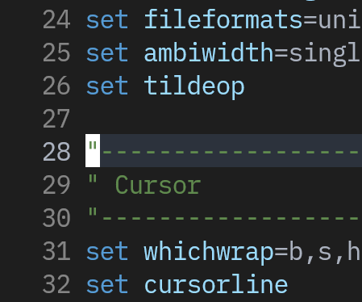
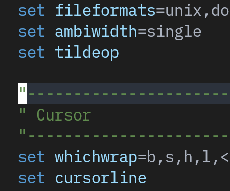
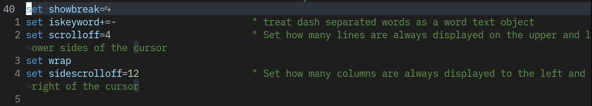
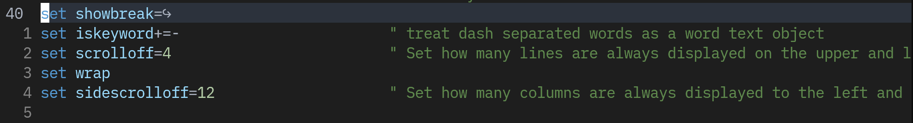
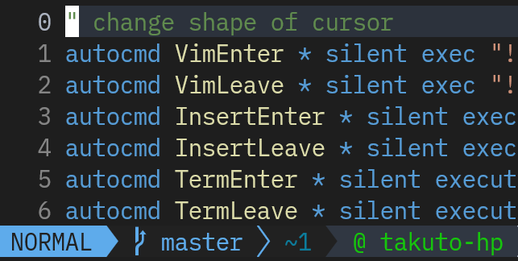
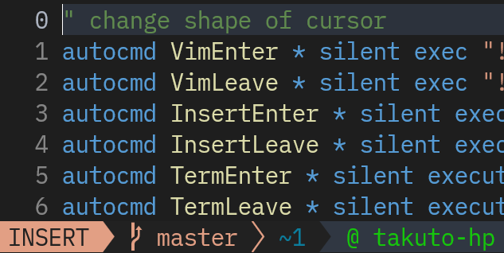

# Start Working on Your Nvim Config!

Nvim の設定ファイルをいじる上で必要になる知識を紹介します

## `~/.config/nvim/init.{vim,lua}`

Nvim の設定ファイルは 2 種類の言語 (`vimscript`, `lua`) で書くことができます。

どちらで書いても構いませんが、最近の主流は `lua` で書くことで、この wiki でも lua をメインに紹介します。
`lua` のほうが動作が速いですが、`vim`との互換性が一切ないです。
どちらで書いても相手の言語を呼び出したり import したりできるので楽な方で書きましょう。

決めたら次のどちらかのファイルを作って `nvim` で開きましょう。

```bash
# vimscript
mkdir -p ~/.config/nvim
nvim ~/.config/nvim/init.vim

# lua
mkdir -p ~/.config/nvim
nvim ~/.config/nvim/init.lua
```

## Nvim Options

Nvim は膨大なオプションを設定できます。オプションは Nvim の挙動を変更します。
変更をその場で適用するには、次のコマンドを実行しましょう。

- `init.vim` : `:source %<CR>`
- `init.lua` : `:luafile %<CR>`

また、詳細が知りたい場合は`:h whichwrap`のようにオプション名をヘルプで検索できます。

それぞれの章のコードは `vim`, `lua` の順で並んでいます。

### Mouse and Cursor

```vimscript
set mouse=a                             " Enable your mouse

set hidden                              " Allow switching from unsaved buffers
" set number                            " Allow absolute line numbers
set relativenumber                      " Allow relative line numbers
set numberwidth=1                       " Set the width of the number column, default is 4
set wrap
set scrolloff=4                         " Set how many lines are always displayed on the upper and lower sides of the cursor
set sidescrolloff=12                    " Set how many columns are always displayed to the left and right of the cursor
```

```lua
vim.opt.mouse = "a"

vim.opt.hidden = true
-- vim.opt.number = true
vim.opt.relativenumber = true
vim.opt.numberwidth = 1
vim.opt.wrap = true -- `nowrap` -> false
vim.opt.scrolloff = 4
vim.opt.sidescrolloff = 12
```

- `number` and `relativenumber` (`rnu`)

|         | `number`                            | `nonumber`                              |
| ------- | ----------------------------------- | --------------------------------------- |
| `rnu`   |      |      |
| `nornu` |  |  |

|          | `wrap` vs `nowrap`              |
| -------- | ------------------------------- |
| `wrap`   |      |
| `nowrap` |  |

### Indentation

- デフォルトでは 6 幅タブインデントとかいうトチ狂った設定なので、4 スペースインデントに変更する

```vimscript
set expandtab                           " Use spaces instead of tabs
set tabstop=4                           " Width of a tab displayed
set softtabstop=4                       " Delete 4 spaces at once
set autoindent                          " Auto-indent, press o on the current line, the new line is always aligned with the current line
set smartindent                         " Set smart indent
set smarttab                            " Makes tabbing smarter will realize you have 2 vs 4
set shiftwidth=4                        " The width of indentation
set showtabline=2                       " Always show tabs
```

```lua
vim.opt.expandtab = true                -- Use spaces instead of tabs
vim.opt.tabstop = 4                     -- Width of a tab displayed
vim.opt.softtabstop = 4                 -- Delete 4 spaces at once
vim.opt.autoindent = true               -- Auto-indent, press o on the current line, the new line is always aligned with the current line
vim.opt.smartindent = truen             -- Set smart indent
vim.opt.smarttab = truen                -- Makes tabbing smarter will realize you have 2 vs 4
vim.opt.shiftwidth = 4                  -- The width of indentation
vim.opt.showtabline = 2                 -- Always show tabs
```

## Change Cursor Shape by Input Mode

Normal Mode (矩形), Insert Mode (棒)でカーソルの形を変更する

```vimscript
augroup ChangeCursorShape
  autocmd!
  autocmd VimEnter * silent execute "! echo -ne '\e[1 q'"
  autocmd VimLeave * silent execute "! echo -ne '\e[5 q'"
  autocmd InsertEnter * silent execute "!echo -en '\e[5 q'"
  autocmd InsertLeave * silent execute "!echo -en '\e[1 q'"
  autocmd TermEnter * silent execute "!echo -en '\e[5 q'"
  autocmd TermLeave * silent execute "!echo -en '\e[1 q'"
augroup END
```

```lua
local changeCurShape = vim.api.nvim_create_augroup("ChangeCursorShape", {})
vim.api.nvim_create_autocmd({ "VimEnter", "InsertLeave", "TermLeave" }, {
  group = changeCurShape,
  command = [[silent execute "! echo -ne '\e[1 q'"]],
})
vim.api.nvim_create_autocmd({ "VimLeave", "InsertEnter", "TermEnter" }, {
  group = changeCurShape,
  command = [[silent execute "! echo -ne '\e[5 q'"]],
})
```

| Normal Mode                            | Insert Mode                            |
| -------------------------------------- | -------------------------------------- |
|  |  |

## **Others**

[My General Option Configs](https://git.esslab.jp/takuto/dotfiles/-/blob/master/nvim/general/settings.vim)

- 結構これが日本語も使うのであればちょうどいいと思う
- **vimscript only**

## Tips

- nvim の設定ファイルたちを Git で管理する : [/Tips/manage-dotfiles](/Tips/manage-dotfiles)
- `lua` ファイルで `vimscript`、`vim` ファイルで `lua` をそれぞれ呼び出す方法 : [/Tips/exec-cmd](/Tips/exec-cmd)

---

<span style={{ textAlign: "center" }}>
  [次回](plug-config)ではnvimの本髄、ついにプラグインを入れてみましょう。
</span>

---
