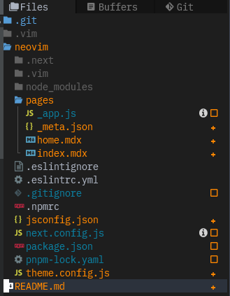

# Neovim セットアップの諸々

## Table of Contents

- [Introduction](#)
- [Get Started](startup) : How to install neovim.
- [Your First Config File](first-config) : Create your first config file and manage it with git.
- [Plugin Configs](plug-config) : Work with plugins.
  - 00 - 80 config : How to setup useful plugins
- [Themes](themes) : List of many other themes I recommend.
- [Plugins](plugins) : List of many other plugins I recommend.

## 最終的な見た目

- `colorscheme = vscode` -> [10-color-config](10-color-config)

- Telescope Fuzzy Find Files

- Telescope Fuzzy Project Search

- Neo-tree (Explorer)



- Git Managements

## 気を付けてほしいこと

- ここにあるすべての設定を入れたらオーバースペックです
  - 取捨選択して取り入れましょう
- 設定は時々壊れます。根気よく直すかIssueを探しましょう
- いざというときのためにプラグインに依存しない使い方も学びましょう
- Vimは楽しいぞい

## Notes

- My configuration files
```txt
~/.config/
  └ nvim/ https://git.esslab.jp/takuto/dotfiles/-/tree/master/nvim
    └ lua/ https://git.esslab.jp/takuto/dotfiles/-/tree/master/nlua
```
