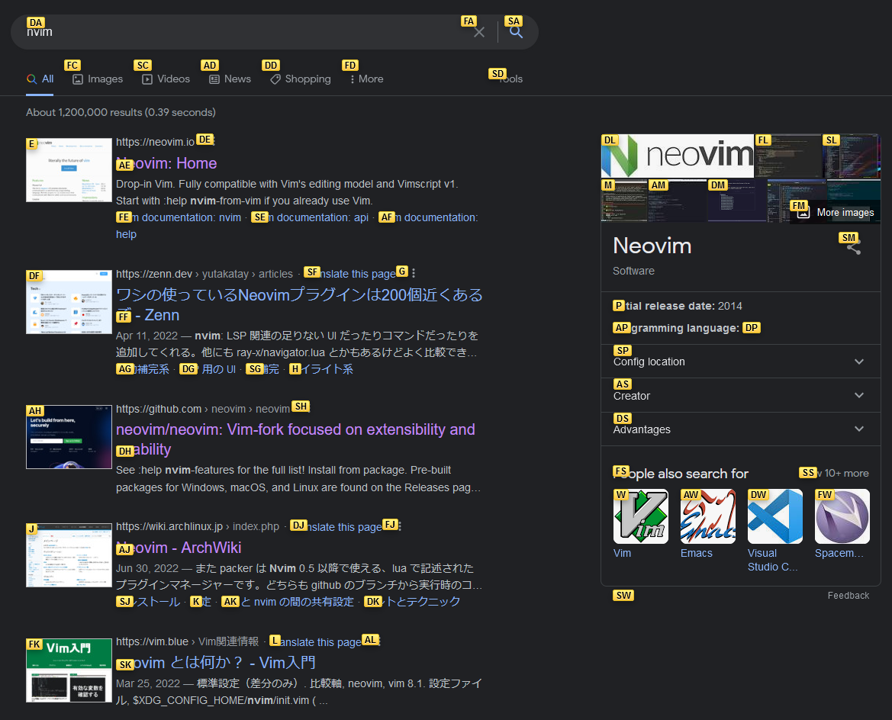

# Get Neovim Working on Your PC!

Nvim のインストールと環境設定をしましょう。

## Install `nvim`

`nvim`の _正しい_ インストールの仕方は下のどちらかに従って入れる方法です。

- [Binary Install](https://github.com/neovim/neovim/releases/)
- [Install with Package Manager (`apt, brew, ...`)](https://github.com/neovim/neovim/wiki/Installing-Neovim#install-from-package)

しかし `nvim` はまだ開発途中で日々目新しい機能が追加されていきます。それをすぐに享受したい人は `Build from Source` をやりましょう。~~ただし時々バグります~~

- 環境変数の設定
  - `~/.bashrc` などに追加しておきましょう

```bash
# XDG Base Directory specification
# For more info, see https://wiki.archlinux.org/title/XDG_Base_Directory
export XDG_CONFIG_HOME="$HOME/.config"
export XDG_CACHE_HOME="$HOME/.cache"
export XDG_PREFIX_HOME="$HOME/.local"
export XDG_DATA_HOME="$XDG_PREFIX_HOME/share"
export XDG_STATE_HOME="$XDG_PREFIX_HOME/state"
export XDG_BIN_HOME="$XDG_PREFIX_HOME/bin"
export PATH="$XDG_BIN_HOME:$PATH"

export NVIM_INSTLL_DIR="$XDG_DATA_HOME/nvim-git"
export NVIM_BUILD_TAG="nightly" # or "stable"
```

- install nvim from source

```bash
mkdir -p "$NVIM_INSTLL_DIR"
git clone --depth 1 "https://github.com/neovim/neovim.git" "$NVIM_INSTLL_DIR"
current_dir="$PWD" && cd "$NVIM_INSTLL_DIR"
git submodule update --init --recursive
git fetch --tags -f
git checkout "$NVIM_BUILD_TAG"
make CMAKE_BUILD_TYPE=RelWithDebInfo CMAKE_INSTALL_PREFIX="$XDG_PREFIX_HOME" install
cd "$current_dir"
```

## Run `:checkhealth`

- 無事 Nvim をインストールできたら、起動して環境が整っているか確かめましょう
- `nvim`で起動したら、`:checkhealth`と打って ENTER を押してください
- なるべく全部 OK になるように指示に従ってください
  - Clipboard (optional) は特に大事です


## Fonts and Terminals

### Fonts

Nvim はすべてターミナル上で動くのでデザインはすべて特殊文字を使って行なっています。
この特殊文字をサポートしているフォント群 ([Nerd Fonts](https://www.nerdfonts.com/)) をインストールしてください。
入れたら、使ってるターミナルの設定からフォントを変更してください。

または Nerd Fonts の派生形でもよくて、私はこれらなんかをお勧めします。インストールするときに`xxx_NF_v0.0.0.zip` (NF=Nerd Fonts) を選んで入れてください。

- [PlemolJP](https://github.com/yuru7/PlemolJP)
- [HackGen](https://github.com/yuru7/HackGen)

その他フォント関連の情報　~~ようこそフォント沼へ~~

- [PlemolJP vs HackGen 比較記事](https://pouhon.net/font-plemol/6599/)
- [ほかのおすすめフォント](https://qiita.com/sl2/items/bf58dadb261c0a019571)

### Terminal

色を楽しむなら、`True colors`をサポートしているターミナルが好ましいです。

- Macbook
  - デフォルトの `端末` って名前のやつは好ましくない
  - `iTerm2` が一番いいと思います
- Linux
  - 基本どれでもいい
  - 最近の流行りは多分 [alacritty](https://alacritty.org/) と [kitty](https://sw.kovidgoyal.net/kitty/)
  - Alacritty は軽くてシンプル。Kitty はとてもいろいろできるしプラグインが豊富、なのに軽い
- Windows
  - 私はうまくいったためしがない。今回はサポート対象外
  - WSL でならちゃんと動きます
  - ターミナルは [Windows Terminal](https://docs.microsoft.com/en-us/windows/terminal/install) がおすすめ

## Get Used to Nvim!

Nvim を使ってみましょう。`nvim <file-name>`とすることで nvim でファイルを開くことができます。

例えばこんなコマンドを使って編集してみましょう。

- `h, j, k, l` : Move Left, Down, Up, Right
- `i` : Go into **Insert Mode**
- Write something. In insert mode, you can write to the file.
- `<Esc>` (escape key) : Get out from **Insert Mode** and go back to **Normal Mode**
- `dd` : Delete a line.
- `diw` : Delete a word.
- `:wq<CR>` (`<CR>` is the Enter key) : Write to file and Quit

`vimtutor` というコマンドを実行すると、`vim`の使い方を教えてくれるプログラムが始まります！ぜひやってみましょう。

---

<span style={{ textAlign: "center" }}>
  [次回](first-config)は自分の設定ファイルを書く方法について説明します。
</span>

---

## Optional

- [tmux](https://github.com/tmux/tmux)
  - A very nice and easy-to-use terminal multiplexer
  - [tmux-setup.wiki.pysan3](/tmux) **TODO**
- Vimium: [Chrome Web Store](https://chrome.google.com/webstore/detail/vimium/dbepggeogbaibhgnhhndojpepiihcmeb) [Firefox ADD-ONS](https://addons.mozilla.org/en-US/firefox/addon/vimium-ff/)
  - vim-like keybinds for browsers
  - Scrolling with `j / k`
  - Change tabs with `J / K`
  - Go back `H`, Forward `L` in history
  - Jumping to links with keys
    
